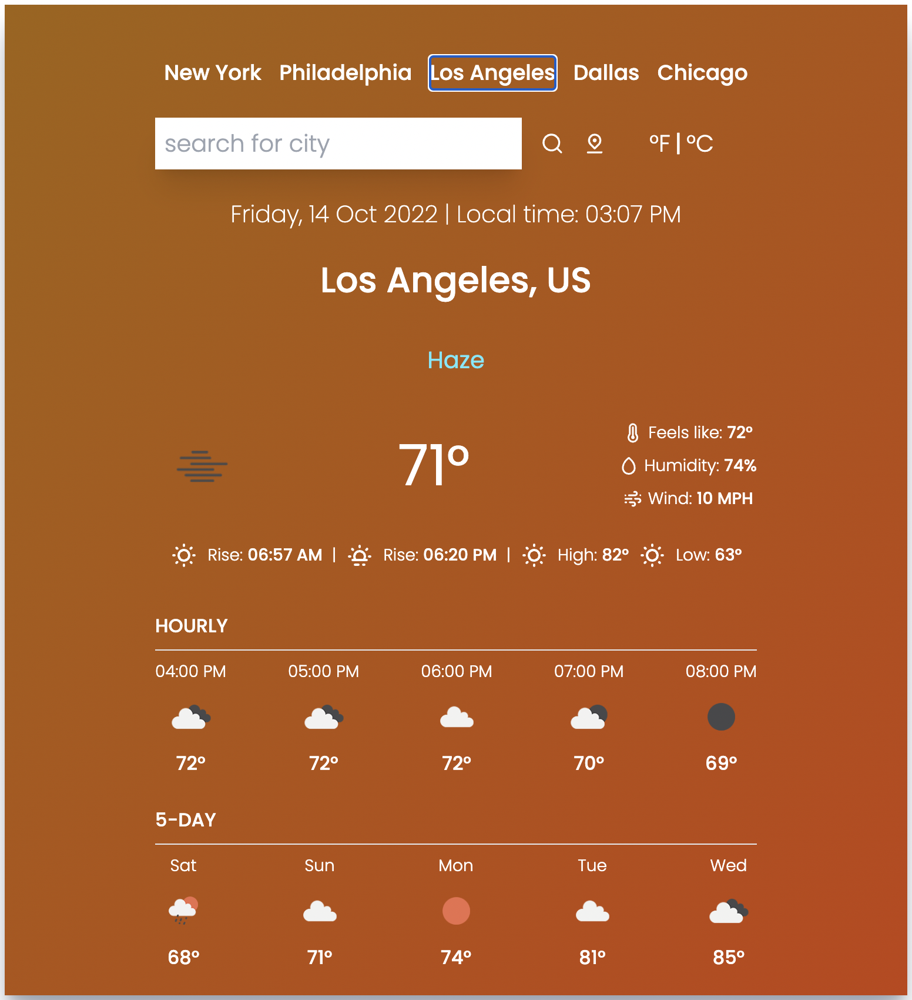

# Weather_App

A simple weather dashboard created using react and tailwind. This app uses open weather API to retrieve the current weather in any major city in the world. 

# Inspiration

I wanted to polish up on my API skills and the most simple and entertaining project to practice those skills is creating a weather app. 

I always wanted to improve on my react skills while also learning a new framework in tailwind. This is my first project using Tailwind and i look forward to improving these skills on my next passion project.

# Usage

    <a href="https://fredkammweatherapp.netlify.app/">
        Visit my site here!
    </a>

    
    

    
Notice that the background color is different in the two screenshots   This happens based off temperatures. Currently, when the temperature is ABOVE 60° the background color will be orange. When temperature is BELOW 60° the background changes to blue

# Tools Used

- React.js
- TailwindCSS
- React-Unicons (for the icons)
- Open Weather API
- Luxon (used for the current date and time)

# Questions

    
Any questions or would like to collaborate Please shoot me an <a href="mailto:fred.kamm95@gmail.com"> Email </a>

    
If you would like to view more of my work  Visit my <a href="https://github.com/fredkamm ">Github</a> profile

